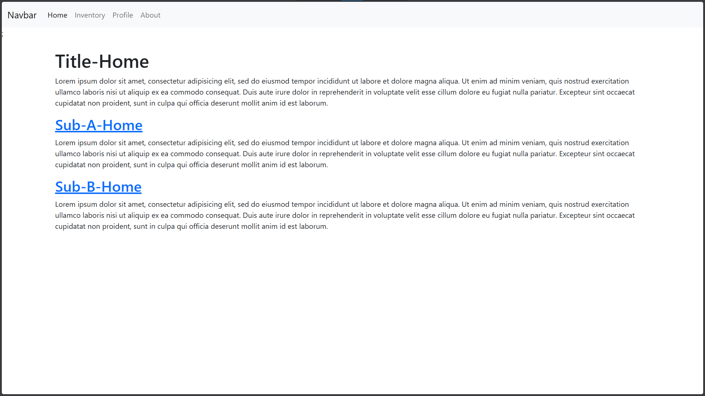
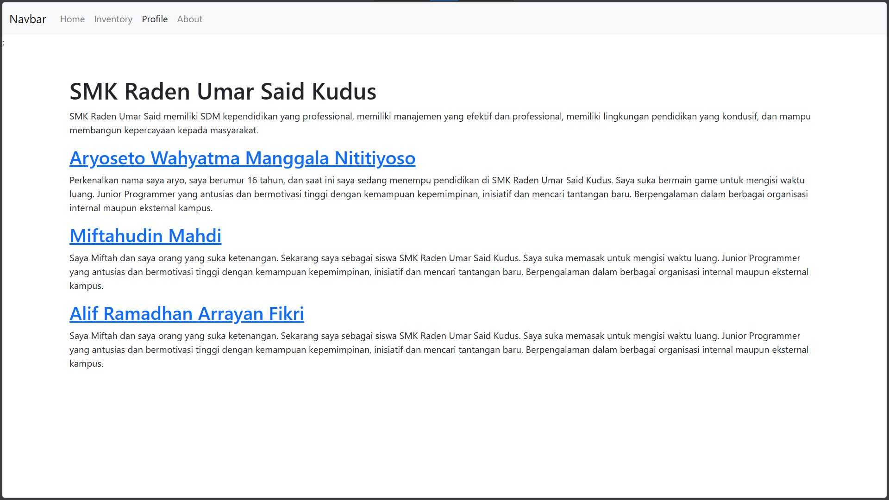
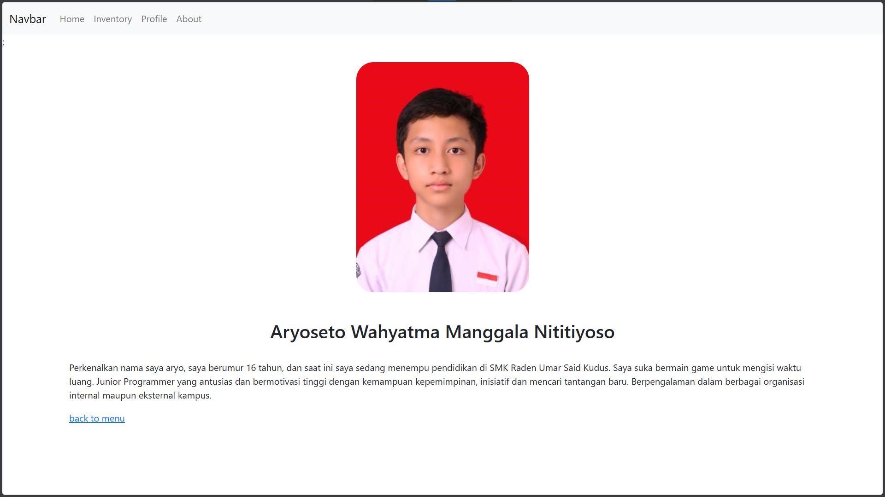

# Biodata Web (Laravel 8 / PHP)

Nov 17, 2021 | Built in 11th grade (Semester 1) | This Laravel web project is a simple **biodata / personal profile website** to practice basic Laravel routing, Blade views, and simple page navigation (Home, About, Profile).

---

## Preview (Screenshots)

| Home | About | Profile |
|---|---|---|
|  |  |  |

---

## Features

- Home page
- About page
- Profile page (biodata)
- Simple navigation between pages
- Laravel Blade-based UI

---

## Tech Stack

- **Language:** PHP  
- **Framework:** Laravel 8  
- **Package Manager:** Composer  
- **Frontend Tooling:** Laravel Mix (Webpack)  
- **Server (Local):** PHP built-in server / Laravel Artisan serve  
- **PHP Version:** ^7.3 or ^8.0  

---

## Project Structure (High Level)

- `app/` - Application source code (controllers, etc.)
- `routes/` - Web routes
- `resources/views/` - Blade templates (UI)
- `public/` - Public web root (assets entry)
- `config/` - Laravel configuration
- `database/` - Migrations/seeders (if used)
- `docs/` - Screenshots for README
- `composer.json` - PHP dependencies
- `package.json` + `webpack.mix.js` - Frontend build tooling

---

## Getting Started

### Requirements
- PHP (7.3+ recommended)
- Composer
- (Optional) Node.js + npm (if you want to build frontend assets)

### Run Locally
1. Clone the repository:
   ```bash
   git clone https://github.com/Aryosetowmn/webdev_kelas11semester1_port6.git
   ```
2. Install dependencies:
   ```bash
   composer install
   ```
3. Copy env file & generate app key:
   ```bash
   cp .env.example .env
   php artisan key:generate
   ```
4. Run the app:
   ```bash
   php artisan serve
   ```
5. Open in browser:
   - http://127.0.0.1:8000

---

## Notes

This repository is intended for learning and portfolio demonstration.  
For a more “real-world” Laravel app, consider adding database integration, authentication, and a cleaner structure (controllers + validation + models).

---

## Author

**Aryosetowmn**  
Repository: `Aryosetowmn/webdev_kelas11semester1_port6`
